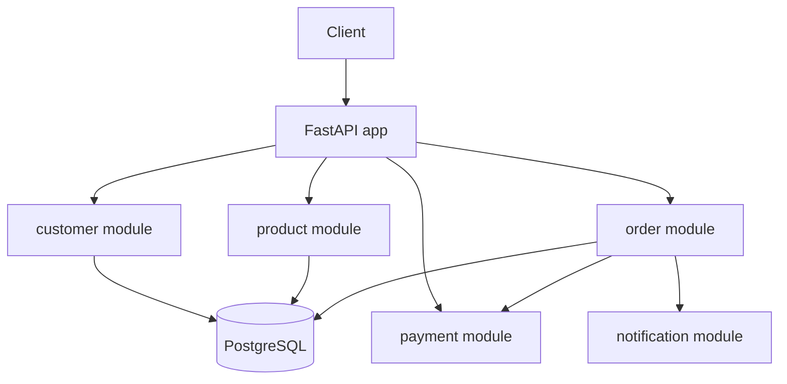
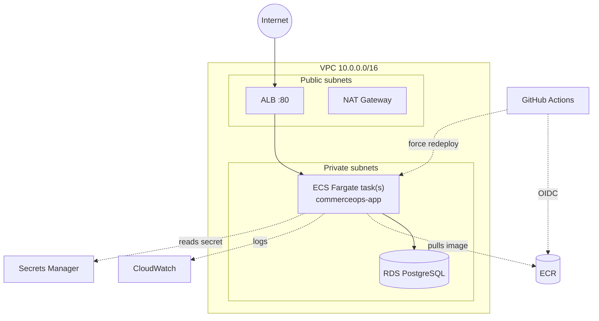
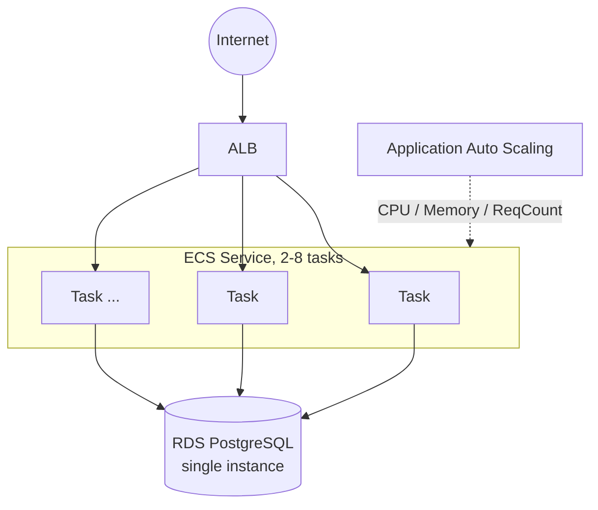

# CommerceOps AI Platform

The [CommerceOps AI Platform learning project](../Solution%20Architect%20Learning%20Project.md): a FastAPI + PostgreSQL modular monolith covering the Customer, Product, Order, Payment, and Notification domains, evolving version by version toward microservices, event-driven architecture, CQRS, Saga, and an AI Operations Agent.

* **V0 — Local Modular Monolith**: Docker Compose, no AWS. See below.
* **V1 — AWS Foundation**: deploy the same app to ECS/Fargate behind an ALB, backed by RDS. See [Deploying to AWS (V1)](#deploying-to-aws-v1) below.
* **V2 — Horizontal Scaling**: ECS Service Auto Scaling (CPU/memory/request-count target tracking) + tuned DB connection pooling + a Locust load test, for a flash-sale traffic spike. See [Horizontal Scaling (V2)](#horizontal-scaling-v2) below.

## V0: Local architecture



One deployable process, one database. Each domain is a self-contained package (`models.py` / `schemas.py` / `service.py` / `router.py`) so the boundaries a future microservice split would use already exist — see [ADR-001](docs/adr/ADR-001-modular-monolith.md).

## Project structure

```
app/
├── main.py                 # FastAPI app, routers, startup table creation
├── core/
│   ├── config.py           # environment-driven settings
│   └── database.py         # SQLAlchemy engine/session, Base, get_db
├── customer/                # create, get
├── product/                  # create, get, list, update
├── order/                     # create, get, list, cancel (+ transaction logic)
├── payment/                    # fake payment provider
└── notification/                # logs-only notification channel

tests/
├── unit/          # pure logic, no DB (payment randomness, notification logging, line-total calc)
└── integration/   # FastAPI TestClient against an in-memory SQLite DB

docs/
├── api.md                          # endpoint reference
├── database_schema.md              # ER diagram
├── deployment.md                   # V1: step-by-step AWS deployment; V2: load-test run guide
└── adr/
    ├── ADR-001-modular-monolith.md
    ├── ADR-002-aws-foundation.md
    └── ADR-003-horizontal-scaling.md

infra/                             # V1/V2: Terraform (see "Deploying to AWS" below)
├── bootstrap/                      # one-time: remote state S3 bucket + DynamoDB lock table
├── modules/                        # vpc, security_groups, ecr, s3, iam, rds, alb, ecs, autoscaling, cloudwatch
└── environments/dev/               # wires the modules together for the dev environment

loadtest/                          # V2: Locust load test (see "Horizontal Scaling" below)
├── locustfile.py
└── requirements.txt

.github/workflows/deploy.yml        # V1: build/push to ECR + redeploy ECS on push to main
```

## Tech stack

Python 3.11+, FastAPI, SQLAlchemy 2.0, PostgreSQL 16, Docker / Docker Compose, pytest, Locust (V2 load testing).

## Running with Docker Compose (recommended)

```bash
docker compose up --build
```

* App: http://localhost:8000 (Swagger UI at `/docs`, health check at `/health`)
* Postgres: `localhost:5432` (user/password/db: `commerceops`)

## Running locally without Docker

```bash
python -m venv .venv
.venv\Scripts\activate            # Windows
# source .venv/bin/activate       # macOS/Linux

pip install -r requirements.txt

# Start Postgres only, then point the app at it:
docker compose up -d db
copy .env.example .env            # Windows; edit DATABASE_URL to use "localhost" instead of "db"
# cp .env.example .env            # macOS/Linux

uvicorn app.main:app --reload
```

## Running tests

```bash
pip install -r requirements.txt
pytest -v
```

Integration tests run against an in-memory SQLite database (no Docker/Postgres required), so they're fast and portable. Docker Compose's Postgres remains the real deployment target — this is a deliberate trade-off, documented in [docs/database_schema.md](docs/database_schema.md).

## API overview

See [docs/api.md](docs/api.md) for the full endpoint reference, or browse `/docs` once the app is running.

Core flow: create a customer -> create products -> `POST /orders` (validates stock, decrements it, calls the fake payment provider, updates order status) -> `POST /orders/{id}/cancel` (restocks items).

## Database schema

See [docs/database_schema.md](docs/database_schema.md) for the ER diagram and table notes.

## SA concepts covered in V0

* **Domain boundaries / modular monolith** — one process, clearly separated domain packages.
* **Separation of concerns** — model / schema / service / router layering within each module.
* **ACID transactions** — order creation, item persistence, and stock decrement commit atomically; payment failure triggers a compensating restock (a small preview of the Saga pattern from V12).
* **Basic API design** — resource-oriented REST endpoints, explicit status codes (404/409), request/response schemas separate from persistence models.

## Deploying to AWS (V1)

Same application code and Docker image as V0 — no microservices yet. Deployed on ECS/Fargate behind an ALB, with RDS PostgreSQL replacing the Docker Compose Postgres container.



* **Infrastructure as code**: Terraform, under [infra/](infra/) — `bootstrap/` (one-time remote state backend), `modules/` (vpc, security_groups, ecr, s3, iam, rds, alb, ecs, autoscaling, cloudwatch), `environments/dev/` (wires them together).
* **CI/CD**: [.github/workflows/deploy.yml](.github/workflows/deploy.yml) builds the Docker image, pushes to ECR, and force-redeploys the ECS service on every push to `main` that touches `app/**`/`Dockerfile` — authenticated via GitHub OIDC (no long-lived AWS keys).
* **Full step-by-step commands** (install CLIs, bootstrap state, `terraform apply`, first image push, verification, teardown): [docs/deployment.md](docs/deployment.md).
* **Why ECS/Fargate/RDS/private-subnets, what the ALB does, what happens when a task dies, and the trade-offs made** (single NAT GW, single-AZ RDS, HTTP-only ALB, `:latest`-tag deploys): [ADR-002](docs/adr/ADR-002-aws-foundation.md).

## Horizontal Scaling (V2)

New requirement: a flash sale spikes traffic from ~300 req/s to ~5,000 req/s for ~10 minutes, then back to normal. The app must scale out and back in automatically instead of running a fixed task count sized for peak (wasteful) or for average (falls over during the spike).



* **Auto Scaling**: [infra/modules/autoscaling](infra/modules/autoscaling) — three target-tracking policies (CPU 60%, memory 70%, ALB requests/target 300) on one scalable target, `min_capacity=2`/`max_capacity=8`. `desired_count` on the ECS service is now just the *initial* count; Terraform ignores drift on it so Auto Scaling can own it at runtime.
* **DB connection pool**: [app/core/database.py](app/core/database.py) / [app/core/config.py](app/core/config.py) — explicit `pool_size`/`max_overflow` per task, sized against RDS's connection ceiling at `max_capacity` tasks.
* **Load test**: [loadtest/locustfile.py](loadtest/locustfile.py) (Locust) — run the staged 100/500/1,000/5,000 req/s experiment from [docs/deployment.md](docs/deployment.md#6-v2-load-testing-horizontal-scaling).
* **Why app-tier scaling alone doesn't solve DB scaling** (connections, CPU/IOPS, hot-row contention — and why that motivates V3's cache rather than a bigger DB immediately): [ADR-003](docs/adr/ADR-003-horizontal-scaling.md).

## Roadmap

* [x] V0 — Local Modular Monolith
* [x] V1 — AWS Foundation
* [x] V2 — Horizontal Scaling
* [ ] V3 — Redis Caching
* [ ] V4 — Asynchronous Processing (SQS)
* [ ] V5+ — Reliability, HA, Microservices, Event-Driven Architecture, Kafka, CQRS, Outbox, Saga, AI Operations Agent, Observability, Security, Disaster Recovery, Cost Optimization

Per the [learning project plan](../Solution%20Architect%20Learning%20Project.md).
