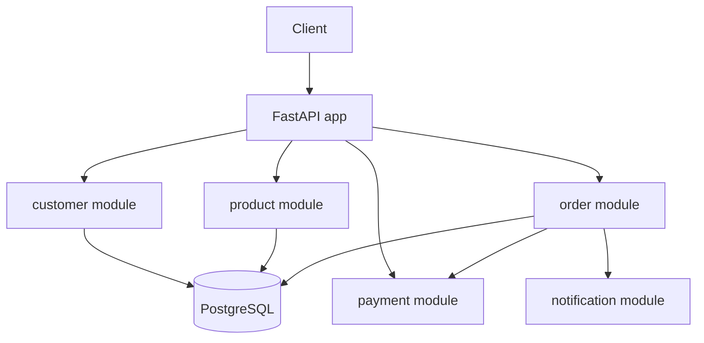

# CommerceOps AI Platform — V0: Local Modular Monolith

V0 of the [CommerceOps AI Platform learning project](../Solution%20Architect%20Learning%20Project.md): a local, Docker-based FastAPI + PostgreSQL modular monolith covering the Customer, Product, Order, Payment, and Notification domains. No AWS yet — that starts at V1.

## Architecture



One deployable process, one database. Each domain is a self-contained package (`models.py` / `schemas.py` / `service.py` / `router.py`) so the boundaries a future microservice split would use already exist — see [ADR-001](docs/adr/ADR-001-modular-monolith.md).

## Project structure

```
app/
├── main.py                 # FastAPI app, routers, startup table creation
├── core/
│   ├── config.py           # environment-driven settings
│   └── database.py         # SQLAlchemy engine/session, Base, get_db
├── customer/                # create, get
├── product/                  # create, get, list, update
├── order/                     # create, get, list, cancel (+ transaction logic)
├── payment/                    # fake payment provider
└── notification/                # logs-only notification channel

tests/
├── unit/          # pure logic, no DB (payment randomness, notification logging, line-total calc)
└── integration/   # FastAPI TestClient against an in-memory SQLite DB

docs/
├── api.md                          # endpoint reference
├── database_schema.md              # ER diagram
└── adr/ADR-001-modular-monolith.md
```

## Tech stack

Python 3.11+, FastAPI, SQLAlchemy 2.0, PostgreSQL 16, Docker / Docker Compose, pytest.

## Running with Docker Compose (recommended)

```bash
docker compose up --build
```

* App: http://localhost:8000 (Swagger UI at `/docs`, health check at `/health`)
* Postgres: `localhost:5432` (user/password/db: `commerceops`)

## Running locally without Docker

```bash
python -m venv .venv
.venv\Scripts\activate            # Windows
# source .venv/bin/activate       # macOS/Linux

pip install -r requirements.txt

# Start Postgres only, then point the app at it:
docker compose up -d db
copy .env.example .env            # Windows; edit DATABASE_URL to use "localhost" instead of "db"
# cp .env.example .env            # macOS/Linux

uvicorn app.main:app --reload
```

## Running tests

```bash
pip install -r requirements.txt
pytest -v
```

Integration tests run against an in-memory SQLite database (no Docker/Postgres required), so they're fast and portable. Docker Compose's Postgres remains the real deployment target — this is a deliberate trade-off, documented in [docs/database_schema.md](docs/database_schema.md).

## API overview

See [docs/api.md](docs/api.md) for the full endpoint reference, or browse `/docs` once the app is running.

Core flow: create a customer -> create products -> `POST /orders` (validates stock, decrements it, calls the fake payment provider, updates order status) -> `POST /orders/{id}/cancel` (restocks items).

## Database schema

See [docs/database_schema.md](docs/database_schema.md) for the ER diagram and table notes.

## SA concepts covered in V0

* **Domain boundaries / modular monolith** — one process, clearly separated domain packages.
* **Separation of concerns** — model / schema / service / router layering within each module.
* **ACID transactions** — order creation, item persistence, and stock decrement commit atomically; payment failure triggers a compensating restock (a small preview of the Saga pattern from V12).
* **Basic API design** — resource-oriented REST endpoints, explicit status codes (404/409), request/response schemas separate from persistence models.

## Roadmap

This repository will evolve version by version, per the [learning project plan](../Solution%20Architect%20Learning%20Project.md): V1 AWS Foundation, V2 Horizontal Scaling, V3 Redis Caching, V4 Async Processing, and onward through microservices, event-driven architecture, CQRS, Saga, and an AI Operations Agent.
