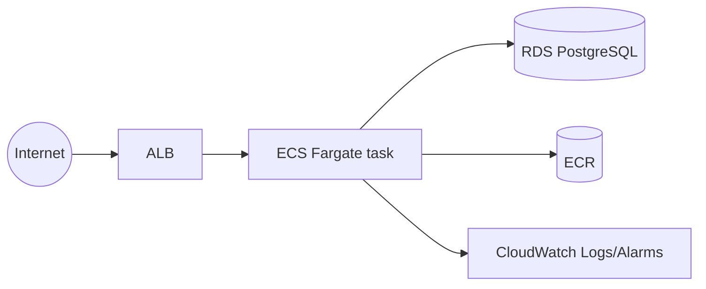

# ADR-002: AWS Foundation for V1

## Context

V0 runs the modular monolith locally via Docker Compose. V1's requirement is simply "deploy the application to AWS, no microservices yet" — there is still one team, one deployable process, and no proven scaling/traffic problem to solve (that starts at V2). The job here is to pick the smallest set of AWS building blocks that gets the existing app running reliably, reachable from the internet, with basic observability — without reaching for anything the requirements don't yet justify (Rule 1 of the learning project).

## Decision

Deploy the existing container image to **ECS on Fargate**, behind an **Application Load Balancer**, connected to a single **RDS PostgreSQL** instance, inside a VPC with public subnets (ALB, NAT) and private subnets (app tasks, database). Supporting infrastructure: ECR (image registry), S3 (ALB access logs + a reserved app-assets bucket), CloudWatch (logs + basic alarms), and IAM (task roles + a GitHub Actions OIDC role for CI/CD). Everything is provisioned with Terraform, split into reusable modules under [infra/modules](../../infra/modules) and wired together in [infra/environments/dev](../../infra/environments/dev).

## Questions to answer (per the learning project spec)

### Why ECS instead of EC2?

Running the app directly on EC2 means we own patching the OS, installing/updating the container runtime, writing our own health-check-and-restart logic, and building our own deployment tooling (rolling updates, draining connections). ECS is a managed control plane that already does all of that: it places tasks, restarts failed ones, integrates natively with the ALB target group and CloudWatch, and gives us a declarative task definition instead of imperative server scripts. For a 5-person team with limited budget, paying AWS to manage the orchestration layer is a better trade than building it ourselves.

### Why Fargate (instead of ECS on EC2)?

ECS supports two launch types: EC2 (we manage the underlying instances) and Fargate (AWS manages the compute, we only specify CPU/memory per task). At V1's scale (single small app, no scaling requirement yet), managing an EC2 cluster (instance sizing, AMI patching, capacity planning, bin-packing tasks onto instances) is pure overhead with no benefit. Fargate costs more per vCPU/GB than equivalent EC2 capacity, but at this traffic level the absolute cost difference is small, and it removes an entire category of operational work. The project brief explicitly calls this out: "Do NOT use EKS yet" — and by the same logic, don't manage raw EC2 capacity yet either. Revisit if/when per-task cost at scale (V2+) makes self-managed capacity worth the operational cost.

### Why RDS instead of self-managed PostgreSQL?

Self-managing Postgres on EC2 means we own backups, patching, failover, and monitoring for the single most important stateful component in the system (it holds every order and payment record). RDS provides automated backups, point-in-time recovery, and (later, V6) Multi-AZ failover as managed features. It also natively supports `manage_master_user_password`, which lets us avoid ever generating or storing a plaintext database password ourselves (see "RDS-managed secret" below). For a small team, the cost of RDS vs. self-managed EC2+EBS is worth it purely for the backup/patching automation, well before any HA requirement kicks in.

### Why private subnets (for ECS tasks and RDS)?

Public subnets have a route to an Internet Gateway; private subnets don't — inbound connections from the internet can only reach resources with a route to them. ECS tasks and RDS have no legitimate reason to accept unsolicited inbound internet traffic; the ALB is the only thing that should be internet-facing. Placing tasks and the database in private subnets means even a security group misconfiguration can't accidentally expose them directly — there's no network path for external traffic to reach them at all except through the ALB. Private subnets still reach the internet *outbound* (e.g. ECS pulling images from ECR) via the NAT Gateway in the public subnet.

### What does the ALB do?

The Application Load Balancer is the single internet-facing entry point. It terminates the client connection, runs periodic HTTP health checks against `/health` on each task, and only forwards traffic to tasks currently passing that check — so a task that's starting up, crashed, or unresponsive is automatically taken out of rotation without any human intervention. It also gives us a stable DNS name / target for scaling (V2 will add more tasks behind the same ALB with no client-visible change) and is where TLS termination will be added later (V17).

### What happens if one ECS task dies?

The ECS **service** (not the task definition alone) is configured with `desired_count = 1` and continuously reconciles actual vs. desired running tasks. If a task crashes, fails its container health check, or the underlying Fargate infrastructure has an issue, ECS detects the task is no longer `RUNNING`, removes it, and launches a replacement task from the same task definition automatically — no manual restart needed. During the replacement window (typically tens of seconds), the ALB's health check will mark the old target unhealthy and stop routing to it; with `desired_count = 1` there's a brief availability gap until the new task passes its health check, which is exactly the argument for horizontal scaling (`desired_count > 1`) — deferred to V2, since V1 has no scaling requirement yet.

## Alternatives considered

* **EKS** — explicitly excluded by the project brief for V1; Kubernetes' operational surface (control plane, node groups, networking plugins, ingress controllers) is not justified before there's a multi-service, multi-team reason for it (that's V7+ territory, and even then plain ECS may suffice).
* **Elastic Beanstalk** — would have gotten a working deployment faster, but hides the underlying VPC/ALB/ECS/IAM wiring the project is explicitly trying to teach. Rejected because the goal here is learning the building blocks, not shipping fastest.
* **Self-managed EC2 + Docker Compose on the instance** — closest to "just copy V0 to a bigger machine". Rejected: no automatic recovery from instance/process failure, no rolling deploys, and it teaches none of the AWS-native primitives (ALB target groups, ECS service scheduling) that later versions build on.

## Trade-offs (deliberately deferred to later versions)

* **Single NAT Gateway** (not one per AZ) — a NAT Gateway failure would cut off outbound internet access for tasks in the other AZ. Acceptable for V1 (no HA requirement yet); revisit at V6/V18.
* **RDS single-AZ, `skip_final_snapshot = true`, `deletion_protection = false`** — optimized for cheap, fast `terraform apply`/`destroy` cycles while learning, not for durability. V6 (Database HA) and V18 (Disaster Recovery) address this properly.
* **ALB is HTTP-only (no TLS)** — no ACM certificate/HTTPS listener yet. Addressed in V17 (Security).
* **`desired_count = 1`, no Auto Scaling** — matches V1's "no scaling yet" scope; V2 is entirely about fixing this.
* **Deploys always push/pull the `:latest` image tag and redeploy via `ecs update-service --force-new-deployment`**, rather than registering a new task definition revision per deploy. Simpler IAM policy for the GitHub Actions role (no `ecs:RegisterTaskDefinition`/`iam:PassRole`), but loses per-deploy task-definition history and one-click rollback. Revisit if rollback speed becomes a real need.
* **No WAF / rate limiting on the ALB** — not required for an internal learning deployment; would be added alongside V17.

## Related decisions

* **State backend: S3 + DynamoDB**, provisioned once via [infra/bootstrap](../../infra/bootstrap), separate from the app's own Terraform state. Chosen over a local `.tfstate` file so state survives across machines/sessions and gets locking (prevents two concurrent `apply`s from corrupting state) — reasonable overhead for the workflow habits this project is trying to build, even solo.
* **Database credentials: RDS-managed master password** (`manage_master_user_password = true`) rather than a Terraform-generated password stored in a `.tfvars` file or state. AWS creates and rotates the secret in Secrets Manager; the ECS task execution role is granted `secretsmanager:GetSecretValue` scoped to that one secret ARN, and the container receives `DB_USERNAME`/`DB_PASSWORD` as ECS `secrets` (never in plaintext in the task definition or Terraform state). This anticipates V17's Secrets Manager learning goal without fully building it out yet — using a single managed secret is low-effort compared to plaintext env vars and closes an obvious security gap for near-zero extra work.
* **CI/CD via GitHub Actions + OIDC**, not long-lived IAM access keys stored as GitHub secrets. The workflow exchanges a short-lived, repo/branch-scoped GitHub-issued token for temporary AWS credentials (`sts:AssumeRoleWithWebIdentity`), which removes an entire class of credential-leak risk and reinforces the IAM learning goal already in scope for V1.
