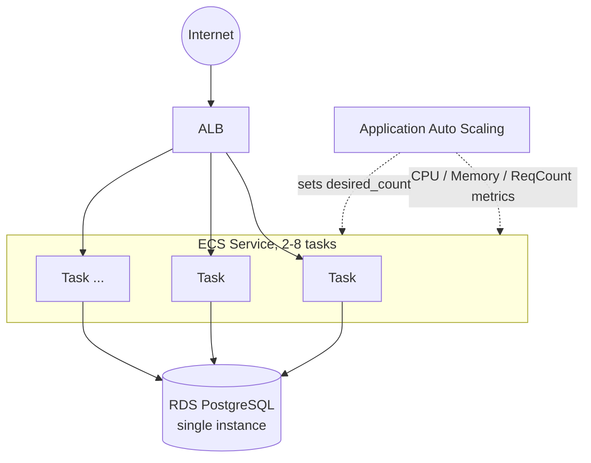

# ADR-003: Horizontal Scaling for V2

## Context

V1 runs a single ECS task behind an ALB — fine for steady ~300 req/s, but the new requirement is a flash sale: traffic jumps from 300 req/s to 5,000 req/s (a ~17x spike) for about 10 minutes, then returns to normal. A single task cannot absorb that, and manually resizing tasks ahead of every sale doesn't scale operationally (it depends on humans knowing exactly when the spike starts). The application already has no server-side session state (auth/session work hasn't started yet, and every request is fully described by the DB), so it is already stateless and safe to run N identical copies of behind the ALB — V2 doesn't need to change that, only prove it and add the scaling mechanism.

## Decision

Add ECS Service Auto Scaling (AWS Application Auto Scaling) on top of the existing ECS service, using three target-tracking policies on the same scalable target, implemented in the new [infra/modules/autoscaling](../../infra/modules/autoscaling) module:

* `ECSServiceAverageCPUUtilization` → target **60%**
* `ECSServiceAverageMemoryUtilization` → target **70%**
* `ALBRequestCountPerTarget` → target **300** req/s per task

`min_capacity = 2`, `max_capacity = 8` ([infra/environments/dev/variables.tf](../../infra/environments/dev/variables.tf)).

Application Auto Scaling scales the ECS service **out** as soon as *any* of the three policies' metric breaches its target, and scales **in** only once *all three* agree it's safe — the request-count policy reacts to a sudden traffic spike faster than the slower-moving CPU/memory averages can, while CPU/memory still veto a premature scale-in.

Two supporting changes make this actually work instead of just existing on paper:

1. **`lifecycle { ignore_changes = [desired_count] }`** on `aws_ecs_service.app` ([infra/modules/ecs/main.tf](../../infra/modules/ecs/main.tf)). Auto Scaling changes `desired_count` directly via the ECS API at runtime; without this, the next `terraform apply` would see that as drift from the static `var.desired_count` and silently reset it, undoing whatever Auto Scaling had done. `desired_count` is now only the *initial* task count.
2. **Explicit, bounded DB connection pool per task** ([app/core/config.py](../../app/core/config.py), [app/core/database.py](../../app/core/database.py)): `db_pool_size=5`, `db_max_overflow=3` (8 connections/task, configurable via env vars). See "Why doesn't app scaling solve DB scaling?" below for why this number was not picked arbitrarily.

Two new CloudWatch alarms ([infra/modules/cloudwatch](../../infra/modules/cloudwatch)) watch the DB tier specifically — `RDS CPUUtilization` and `RDS DatabaseConnections` — so the load test experiment can show *when* the bottleneck moves from the app tier to the database tier.

## Architecture question: why doesn't application scaling automatically solve database scaling?

Because horizontal scaling only duplicates the **stateless** tier. Every one of the 2-8 ECS tasks still talks to the exact same single RDS instance — scaling the app out doesn't create more database, it creates more *clients* of the same database. Concretely, three things don't scale just because task count did:

* **Connections are finite and shared.** `db.t3.micro`'s default `max_connections` is ~112 (`DBInstanceClassMemory / 9,531,392` for its ~1 GiB of RAM). At `max_capacity=8` and `pool_size=5 + max_overflow=3` per task, worst case is `8 * 8 = 64` connections — deliberately kept under ~60% of the ceiling, leaving headroom for `psql`, migrations, and connection churn during scale-out. This is *why* `max_capacity` is 8 and not higher: raising it further doesn't buy more real capacity once the connection budget runs out, it just risks every task's pool failing to check out a connection at once. (This is also why the RDS `DatabaseConnections` alarm exists — to make that ceiling visible.)
* **Compute/IOPS are vertical, not horizontal.** RDS `db.t3.micro` has a fixed vCPU/memory/IOPS budget. Ten app tasks issuing queries concurrently just means ten times the queries hitting the same CPU and disk I/O ceiling — there's no "spread the query across more database instances" happening here (that's what read replicas and sharding are for, and neither exists yet).
* **Hot data gets hit harder, not spread out.** During a flash sale, product listing dominates traffic (per V3's problem statement). More app tasks means more *concurrent identical reads* of the same small set of hot rows — the database does the same repeated work more times in parallel, not less work overall.

The practical consequence, and the reason this ADR exists as a distinct version from V3: this version's load test is expected to show request latency/error rate staying flat as ECS scales out **up to some point**, then degrading anyway as RDS CPU or connections saturate — at which point adding more tasks stops helping and can even make it worse (more tasks competing for the same fixed connection budget). That gap is exactly what motivates V3 (Redis cache in front of the read-heavy product endpoint) rather than reaching for a bigger/multiple database immediately (Rule 1: don't reach for the next tool before the current one's limit is demonstrated).

## Alternatives considered

* **Step scaling instead of target tracking** — step scaling requires hand-picking CloudWatch alarm thresholds and step adjustments (e.g. "+2 tasks if CPU > 70%, +4 if > 90%"). Target tracking asks for one target value and AWS computes the step sizes and evaluates continuously; simpler to reason about and sufficient here. Rejected for now; step scaling would be worth revisiting if target tracking's reaction time (below) proves too slow in the actual load test.
* **Scheduled scaling** (pre-scale to N tasks at the sale's known start time, scale back down after) — would sidestep the target-tracking reaction lag entirely, which suits a *known* flash-sale start time well. Rejected for V2 because it requires the business to know the exact start time in advance and adds a second scaling mechanism to reason about; noted here as a natural complement once a real sale calendar exists, not a replacement for reactive scaling.
* **Scaling on SQS queue depth** — not applicable yet; there is no queue in front of anything until V4 (Asynchronous Processing).
* **A bigger RDS instance / read replica now** — rejected per Rule 1: nothing yet has proven the database is the bottleneck. That evidence is what this version's load test is for; the fix (if needed) is V3's cache, or V6's read replica, not a reflexive resize here.

## Trade-offs (deliberately accepted or deferred)

* **Target-tracking reaction lag.** AWS's target-tracking scale-out typically reacts within 1-3 minutes of a metric breach, and a new Fargate task takes tens of seconds to pull the image and pass its ALB health check on top of that. Against a flash sale that peaks for only ~10 minutes, a meaningful fraction of the spike can pass before capacity fully catches up. Not mitigated in V2 (see "Scheduled scaling" above); expect (and should measure via the load test) a period of elevated latency/errors right at the start of the spike.
* **`max_capacity = 8` is a connection-budget ceiling, not just a cost ceiling.** Raising it without also resizing RDS (bigger instance class, or a proxy such as RDS Proxy) doesn't add real capacity — see the architecture question above.
* **Two target-tracking policies on CPU and memory can occasionally disagree** on the "safe to scale in" moment (e.g. CPU is low but memory is still elevated). This is expected default behavior of Application Auto Scaling (scale-in requires all policies to agree) and is intentionally conservative — better to keep an extra task running briefly than to scale in prematurely into a sustained spike.
* **No pre-warming / target tracking "disable scale-in" toggle for the sale window** — left as a manual lever (`aws application-autoscaling put-scaling-policy` / adjusting `min_capacity` before a known sale) rather than automated; automating it is exactly the "scheduled scaling" alternative above.

## Related decisions

* **RDS instance size is unchanged from V1 (`db.t3.micro`)** — the point of this version's experiment is to *find* the database's limit under app-tier scaling, not to preemptively upsize it. Revisit at V3 (caching removes read load before it reaches the DB) or V6 (HA changes DB sizing/topology for different reasons).
* **Connection pool tuning lives in application config, not infrastructure**, because it's a per-process (per-task) setting that has to be reasoned about jointly with `max_capacity` — keeping both visible in the same place (this ADR) is more useful than splitting the math across Terraform and app code comments alone.
