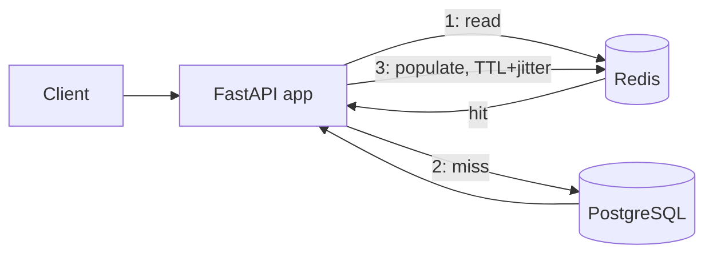

# ADR-004: Caching for Read-Heavy Product Traffic (V3)

## Context

V2's flash-sale load test confirmed the app tier can scale out (Auto Scaling), but every one of those extra ECS tasks opens its own DB connection pool and issues its own queries against the same single RDS instance ([ADR-003](ADR-003-horizontal-scaling.md)'s "why doesn't app scaling solve DB scaling?"). During a flash sale, product listing/browsing is 90%+ of traffic, and product data changes relatively infrequently (an admin edits price/stock occasionally; customers only ever read it). That combination — extremely read-heavy, tolerant of a few seconds of staleness — is close to a textbook case for caching, rather than for scaling the database itself.

Without a cache, 100,000 product reads is 100,000 DB queries. The goal is to absorb the large majority of those reads before they ever reach Postgres.

## Decision

Add a Redis cache-aside layer in front of the two Product read paths (`GET /products/{id}` and `GET /products`), backed by **Amazon ElastiCache for Redis** in AWS and a `redis:7-alpine` container locally.

* **Cache-aside, not read-through/write-through**: the application code (`app/product/service.py`) explicitly checks Redis, falls back to Postgres on a miss, and populates Redis afterward. No library or proxy sits between the app and either store, which keeps the fallback-on-error behavior (below) fully in our control.
* **Two key shapes, two consistency levels**:
  * `product:{id}` — a single, deterministic key. `update_product` actively deletes it after a successful commit, so the next read is guaranteed fresh. Strong consistency for a single entity, at the cost of one extra Redis round-trip per write.
  * `products:list:{skip}:{limit}` — a combinatorial key space over every pagination request a client can make. Actively invalidating "every list key that might contain this product" on every write isn't practical without either tracking every issued key or scanning the keyspace, so this cache is **not** invalidated on write. It relies purely on `cache_ttl_seconds` (default 15s) to bound staleness. This is a deliberate trade-off: listings are eventually consistent within one TTL window; single-product reads are strongly consistent.
* **TTL with +/-10% jitter** (`app/core/cache.py`'s `_jittered_ttl`): many keys get written around the same time (a cold cache after a deploy, or a burst of first-time reads at the start of a flash sale). Without jitter, they'd all expire at the same instant under sustained load, and every one of those expirations would cause a simultaneous DB query — a cache stampede. Jitter spreads the re-population load out over a window instead of a single moment.
* **Graceful degradation on any Redis error**: every cache helper (`cache_get_json`/`cache_set_json`/`cache_delete`) catches `redis.RedisError` and treats it as a miss/no-op, never propagating an exception to the caller. See "What happens when Redis dies?" below.
* **`CACHE_ENABLED` toggle**: a single env var short-circuits every cache helper to act as if every call missed, without touching infrastructure. This exists specifically to run the "without cache vs with cache" experiment the learning project spec calls for using the exact same deployed stack.

## Alternatives considered

* **Per-process in-memory cache** (e.g. `functools.lru_cache`, or a plain module-level dict) — the simplest possible option, no new infrastructure at all. Rejected: V2 already made the app horizontally scaled and stateless by design (2-8 ECS tasks behind an ALB with no session affinity). An in-memory cache would be inconsistent across tasks (a write invalidates the cache in only one task's memory, not the other seven's) and cold on every deploy and every scale-out event — exactly the two moments a flash sale is most likely to trigger. A shared external cache avoids both problems.
* **Read replica for the product table** (RDS Read Replica) — offloads reads to a second Postgres instance, deferred to V6 (Database HA). Rejected for now: a read replica still runs full SQL queries (just on different hardware), whereas a cache serves already-shaped responses out of memory at a fraction of the latency/cost, and directly targets the specific "hot path" (product reads) rather than every query. Revisit if the workload grows write-heavy replicas can't help with, or if cache hit ratio proves too low for the traffic shape.
* **Write-through cache** (write to Redis and Postgres together, in the write path) — would keep `product:{id}` always warm, but adds Redis to the critical path of every write and raises the question of what happens if the Redis write succeeds and the Postgres write fails (or vice versa) — real complexity for a case where cache-aside's "invalidate, let the next read repopulate" is simpler and already sufficient at this scale.
* **DAX-style dedicated caching service** — not applicable; DAX specifically accelerates DynamoDB, and this system's source of truth is PostgreSQL.

## Trade-offs

* **Single-node ElastiCache cluster, no Multi-AZ/automatic failover** (`infra/modules/elasticache`). Mirrors V1's single-AZ RDS trade-off, but the consequence is different: losing the *cache* node degrades read latency (every request falls back to Postgres) — it does not cause data loss or an outage, because Redis never held the only copy of anything. Losing the single *RDS* instance, by contrast, would be a real outage. This asymmetry is exactly why it's acceptable to under-invest in cache-tier HA relative to DB-tier HA at this stage.
* **No AUTH token / no TLS on the ElastiCache connection** — consistent with V1's HTTP-only ALB decision: not yet justified for a learning deployment with no real customer data at stake, deferred to V17 (Security) alongside the ALB's TLS gap.
* **List-cache staleness window**: a customer could see a stale product list (e.g. an updated price) for up to `cache_ttl_seconds`. Acceptable for a listing view; the product detail page (which a customer would check before actually buying) is strongly consistent via delete-on-write.
* **No cache warming**: right after a deploy or a fresh scale-out event, the cache starts empty and the first wave of requests for each key still hits Postgres. Jitter limits how many keys expire simultaneously later, but doesn't eliminate the initial cold-start cost. Not addressed here — would only matter if cold-start latency itself became a measured problem.
* **No stampede lock** (e.g. a mutex so only one request repopulates a given expired key while others wait) — jitter alone is the mitigation for this version. A real lock adds coordination complexity (what if the lock-holder crashes mid-repopulation?) that isn't justified until profiling shows jitter alone is insufficient for a specific hot key.

## Questions to answer (per the learning project spec)

### What happens when Redis dies?

Every read (`cache_get_json`) and write (`cache_set_json`/`cache_delete`) to Redis is wrapped in `try/except redis.RedisError` in `app/core/cache.py`, with a short `socket_connect_timeout`/`socket_timeout` (0.2s) so a dead or unreachable Redis fails fast rather than hanging a request. A failure is logged and treated as a miss (for reads) or a no-op (for writes) — it is never surfaced as an application error. The practical effect: every Product endpoint keeps working, just at Postgres-only latency and Postgres-only load, exactly as if `CACHE_ENABLED=false`. This was verified directly: `tests/unit/test_cache.py` exercises this exact path (the default `redis_url` hostname doesn't resolve outside a container), and the manual failure-injection exercise in `docs/deployment.md` stops the Redis container/instance and confirms reads still succeed.

### Should Redis be source of truth?

No. PostgreSQL is the only source of truth in this system. Redis holds only derived, disposable copies of data that already lives durably in Postgres, each with a bounded TTL. Nothing is ever written to Redis that wasn't already committed to Postgres first, and nothing reads Redis as its only source — every cache miss (or Redis outage) falls through to Postgres. This is what makes the "Redis dies" answer above safe: there is no scenario where losing Redis loses data, because Redis never held the only copy of anything.

### What happens when a product changes?

`update_product` commits the change to Postgres first, then calls `cache_delete` on that product's single, deterministic `product:{id}` key. The next `GET /products/{id}` is a guaranteed cache miss, so it reads the fresh row from Postgres and re-populates the cache. Product **list** caches (`products:list:{skip}:{limit}`) are not touched by this — see the next question.

### How do you invalidate the cache?

Two different strategies for two different key shapes, deliberately:

* **Single-product detail** (`product:{id}`) — active invalidation (delete-on-write), because there's exactly one key per product and finding it is O(1).
* **Product listings** (`products:list:{skip}:{limit}`) — passive invalidation via TTL only. The key space is combinatorial over every `(skip, limit)` pair a client could request; there is no single key to delete when a product changes, and tracking/scanning every issued list key just to invalidate it is meaningfully more complexity than this version's requirements justify. A short TTL bounds the staleness window instead. If listings needed strict freshness, the next step would be a smaller, versioned key (e.g. incrementing a `products:list-version` counter on every write and folding it into the list cache key) rather than scanning — worth revisiting if this trade-off stops being acceptable.

## Related decisions

* Builds directly on [ADR-003](ADR-003-horizontal-scaling.md)'s conclusion that app-tier Auto Scaling alone doesn't solve DB-tier load; this is the next step in that chain, before reaching for a Read Replica (V6) or a bigger RDS instance.
* Cache health is surfaced the same way V2 surfaced RDS health: two new CloudWatch alarms (`*-redis-cpu-high`, `*-redis-evictions-high`) dimensioned on the new ElastiCache cluster (`infra/modules/cloudwatch`).
