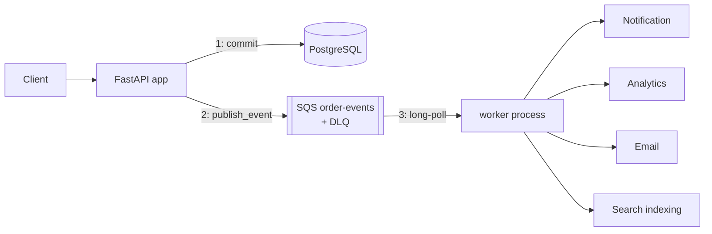

# ADR-005: Asynchronous Processing for V4

## Context

Order creation ([app/order/service.py](../../app/order/service.py)) currently calls `send_notification(...)` in-process, synchronously, at up to two points per request (`OrderCreated`, then `OrderPaid`/`OrderPaymentFailed`). That's cheap today because notification is just a log line — but the new requirement is that order creation should also trigger Analytics, Email, and Search indexing, none of which the customer placing the order needs to wait on. Chaining all of them onto the request path is exactly the anti-pattern the learning project spec calls out:

```text
Create Order -> Notification -> Analytics -> Email -> Search -> Response
```

Every new side effect added this way makes the request slower, and a failure in *any* of them (a slow search index, a flaky email provider) can fail or stall an order that otherwise fully succeeded. None of these four side effects need to be synchronous — the fix is to decouple them from the request path with a queue.

## Decision

Order creation publishes one small event describing what happened; a separate **worker** process consumes it and fans out to all four side effects off the request path.



* **Amazon SQS in AWS, LocalStack locally** — see "LocalStack vs. RabbitMQ" below.
* **[app/core/queue.py](../../app/core/queue.py)**: `publish_event(event_type, payload)` builds `{event_id, event_type, payload, occurred_at}` and `send_message`s it. `event_id` is generated once per logical event (not per delivery attempt), which is what makes idempotency possible later. Failures are caught and logged, never raised — see "best-effort publish" under Trade-offs.
* **[app/order/service.py](../../app/order/service.py)**: all 4 `send_notification(...)` call sites become `publish_event(...)` calls. The order module no longer imports anything from `app.notification` — this is the actual point of decoupling: order creation doesn't know or care what happens with its events afterward.
* **[app/worker.py](../../app/worker.py)**: a standalone process (`python -m app.worker`) that long-polls the queue and, for every message, calls all four handlers uniformly — `send_notification`, `send_email` (new, alongside `send_notification` in [app/notification/service.py](../../app/notification/service.py)), `record_event` (new `app/analytics/service.py`), `index_event` (new `app/search/service.py`). All four are log-only stand-ins, same minimalism as V0's original `send_notification`. No per-event-type routing yet (deferred to V8, EventBridge).
* **A dedicated worker ECS service**, not a background thread inside the API process: it needs to scale independently of the API tier (driven by queue depth, not request rate — see "Backpressure" below), and per-tier IAM least privilege only works cleanly if it's a genuinely separate task ([infra/modules/iam](../../infra/modules/iam), [infra/modules/ecs](../../infra/modules/ecs)). It has its own security group with **no ingress rules at all** ([infra/modules/security_groups](../../infra/modules/security_groups)) — it never accepts inbound traffic, only calls out to SQS and Redis.

### LocalStack vs. RabbitMQ locally

The spec allows either. LocalStack was chosen because it exposes a real SQS API, so `app/core/queue.py` and `app/worker.py` use the exact same `boto3` calls (`send_message`/`receive_message`/`delete_message`/`get_queue_url`) locally and in AWS — the same "same interface, swappable backend" pattern already used for Postgres (Docker container vs. RDS, [ADR-002](ADR-002-aws-foundation.md)) and Redis (Docker container vs. ElastiCache, [ADR-004](ADR-004-caching.md)). RabbitMQ would mean a second client library and protocol (AMQP) with different delivery/ack semantics than SQS, exercised locally but never in AWS — a divergence this project has deliberately avoided everywhere else.

## Alternatives considered

* **RabbitMQ (or another broker) in both environments, including AWS** — rejected: would mean self-managing a broker (or Amazon MQ) instead of using a fully managed queue, with no requirement here (ordering, complex routing, protocol interop) that SQS can't satisfy.
* **SNS + SQS fan-out, or EventBridge** — both add a routing layer so multiple *independent* consumer services can each get their own queue/subscription. V4 has exactly one producer and one logical consumer group (the worker, internally fanning out to 4 handlers) — a routing layer isn't earning its complexity yet. Revisit at V8 (Event-Driven Architecture), when Fraud Detection, AI Agent, etc. are genuinely independent services that shouldn't all share one worker's queue.
* **Kafka** — explicitly rejected per Rule 1 (don't reach for the advanced tool first). Nothing here needs replay, partition ordering, or the throughput Kafka is for; V9 revisits this once "millions of events/day" is a real requirement.
* **A background `asyncio` task inside the FastAPI process instead of a separate worker** — would avoid a second ECS service, but couples the consumer's scaling to the API tier's (CPU/memory/request-count triggers, not queue depth) and makes the "scale workers independently" half of the backpressure experiment impossible to demonstrate.

## Trade-offs (deliberately accepted or deferred)

* **Best-effort publish.** Unlike Redis (never the source of truth — a cache miss just costs latency), a failed `publish_event` call means that order's Notification/Analytics/Email/Search side effects never happen at all; nothing retries the publish itself. This is accepted for V4 (never block or fail the order over a side effect) but is exactly the gap V5 (Reliability) and V11 (Transactional Outbox — publishing atomically with the DB commit instead of as a separate step right after it) exist to close.
* **The publish call itself is still synchronous, in the request path.** V4 removes the four *downstream* side effects from the critical path, not the act of publishing — `send_message` is one small SQS API call (typically single-digit milliseconds), a small fixed cost in exchange for removing four unbounded ones.
* **Redis-only, best-effort idempotency** (`app/core/cache.py`'s `mark_event_processed`) — no authoritative, DB-backed dedup store. If Redis is down, the guard fails open (processes anyway) rather than blocking the worker; see "Idempotency" below for why that's an acceptable trade here specifically.
* **No per-event-type routing** — every event fans out to all four handlers uniformly, even though not every handler is equally relevant to every event type (e.g. search indexing on `OrderCancelled`). Simpler to reason about for a first pass; deferred until there's an actual reason to differentiate (V8).
* **Step-scaling + explicit CloudWatch alarms for the worker**, rather than target tracking — Application Auto Scaling has no built-in predefined metric for SQS queue depth (unlike CPU/memory/ALB request count, which target tracking manages the underlying alarms for automatically). Explicit alarms are more moving parts, but avoid the metric-math complexity a custom target-tracking metric would need.

## Questions to answer (per the learning project spec)

### Visibility timeout

When the worker receives a message, SQS hides it from other receivers for `sqs_visibility_timeout_seconds` (30s, [infra/modules/sqs](../../infra/modules/sqs), matched locally by [infra/localstack/create-queues.sh](../../infra/localstack/create-queues.sh)). If the worker doesn't delete it within that window — because it crashed, or a handler is still running — the message becomes visible again and another `receive_message` call (this worker or another instance) picks it up. 30s comfortably exceeds these handlers' actual runtime (a handful of log calls), leaving headroom before a slow instance falsely looks failed.

### Retry

There's no manual retry loop in [app/worker.py](../../app/worker.py). A handler exception is logged and the message is simply **not deleted** — visibility timeout expiry is the retry: the message becomes receivable again, and gets processed again on a later poll. This is intentionally the simplest possible retry mechanism; exponential backoff (so a persistently failing dependency isn't hammered every 30 seconds) is V5's job, not V4's.

### DLQ

[infra/modules/sqs](../../infra/modules/sqs)'s `order_events` queue has a `redrive_policy` pointing at a dedicated `dlq` queue with `maxReceiveCount = 5`. After 5 failed delivery attempts (the retry mechanism above, repeated), SQS moves the message to the DLQ automatically — no code in `app/worker.py` is involved. The DLQ retains messages for 14 days (SQS's maximum), and `dlq_messages_present` ([infra/modules/cloudwatch](../../infra/modules/cloudwatch)) fires the moment any message lands there, since — unlike a growing main queue, which more workers can fix — a DLQ message has already failed repeatedly and needs a human to look at it.

### At-least-once delivery

SQS guarantees at-least-once, not exactly-once: the same message can be delivered more than once (e.g. the worker processed and deleted it, but the `delete_message` call itself was lost to a network blip before SQS received it). Every handler here is a log line, so a duplicate delivery is harmless by construction for V4 — but the dedup guard below exists anyway, because a future version's handlers (a real email provider, a real analytics sink) won't have that luxury.

### Idempotency

`publish_event` generates `event_id` once per logical event (a `uuid4`), not once per delivery attempt, so every redelivery of "the same" message carries the same `event_id`. `app/worker.py` calls `mark_event_processed(event_id, ttl)` (`app/core/cache.py`, `SET NX EX` on `processed_event:{event_id}`) before dispatching; a `False` result means this `event_id` was already handled, so it's skipped. This is deliberately **best-effort, not authoritative**: if Redis is unreachable, it fails open (treats the event as new) rather than blocking the worker — the same "Redis is never allowed to block correctness" rule as every other cache helper in this codebase, extended here to mean "at most, occasionally reprocess a duplicate," which every current handler tolerates. A real business-effect-preventing dedup (e.g. "never charge a card twice," "never send the exact same confirmation email twice") needs a durable, authoritative store — that's V5's deeper idempotency work, once handlers have real side effects worth strictly deduplicating.

### Backpressure

The queue itself *is* the backpressure buffer: `publish_event` never waits on or even knows about consumer speed, so a producer burst just makes the queue longer, not slower. [loadtest/queue_experiment.py](../../loadtest/queue_experiment.py) demonstrates this directly — publish ~5,000 events as fast as possible while a single artificially-slowed consumer drains at ~500/sec; `ApproximateNumberOfMessagesVisible` (readable via `queue_experiment.py depth`, `awslocal sqs get-queue-attributes` locally, or the CloudWatch alarms in AWS) grows during the burst and shrinks once more workers are added (`docker compose --scale worker=N` locally; the `worker_queue_depth_high`/`worker_queue_depth_low` step-scaling alarms in [infra/modules/autoscaling](../../infra/modules/autoscaling) in AWS) — see [docs/deployment.md](../deployment.md)'s "V4: Asynchronous Processing" section for the full staged run.

## Related decisions

* Builds on [ADR-004](ADR-004-caching.md)'s Redis infrastructure, reused here for the idempotency guard rather than introducing a second stateful dependency just for dedup.
* Directly resolves [ADR-003](ADR-003-horizontal-scaling.md)'s "Scaling on SQS queue depth — not applicable yet" note.
* The best-effort publish gap motivates V5 (Reliability: retry/backoff/circuit breakers/idempotency done properly) and V11 (Transactional Outbox: publish atomically with the DB commit instead of as a separate step right after it).
* The single-queue, uniform-fan-out design is intentionally the simplest thing that satisfies V4; V8 (Event-Driven Architecture) is where per-event-type routing and independent consumer services are revisited once there's an actual second producer or a consumer that shouldn't share this worker's queue.
