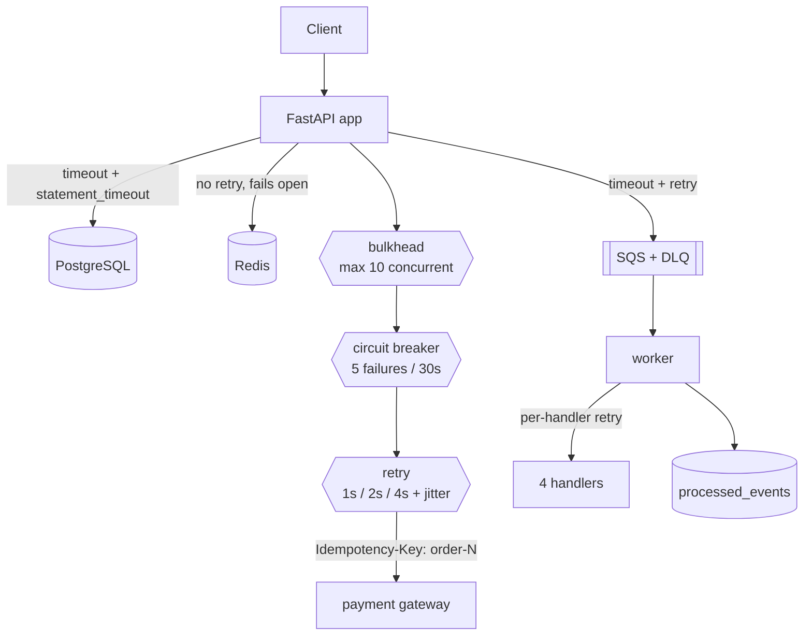

# ADR-006: Reliability for V5

## Context

Every version up to V4 was built on an assumption that is never true in production: **dependencies answer**. Postgres accepts the connection, Redis responds, SQS takes the message, the payment "gateway" returns instantly (because it was a `random.random()` call in the same process). Nothing in the codebase had a timeout, a retry, or any notion of a dependency being *down* rather than merely slow.

Concretely, four gaps:

1. **No timeouts anywhere.** `httpx` and `boto3` shipped defaults nobody chose; SQLAlchemy had none at all. A query that hangs holds one of the connection pool's five slots indefinitely, and five such queries starve the entire service of database access.
2. **No retries.** [ADR-005](ADR-005-async-processing.md) accepted a "best-effort publish" — one `send_message` attempt, and a transient blip silently lost that order's side effects entirely.
3. **No failure isolation.** FastAPI runs `def` endpoints in a ~40-thread pool. If payments hang, every in-flight order holds a thread; once all 40 are held, `GET /products` — which touches nothing but Redis and Postgres — queues behind a dependency it doesn't use. A payment outage becomes a total outage.
4. **Idempotency that didn't work.** V4's guard was one Redis `SET NX` per `event_id`, set *before* the handlers ran, with Redis as the sole authority. Two independent bugs, detailed under "Idempotency" below.

The V5 spec also asks for four faults to be injected and survived: payment timeout, 50% API failure, consumer crash, duplicate event.

## Decision

Four composable primitives in [app/core/reliability.py](../../app/core/reliability.py), a real HTTP boundary to fail across, and durable idempotency in Postgres.



### 1. A real dependency to fail against

The payment stub becomes [fake_gateway/](../../fake_gateway/main.py), a separate FastAPI app reached over HTTP. This is not incidental: **none of V5's requirements are expressible against an in-process function call.** You cannot time out a function that never touches the network, and you cannot inject "payment timeout" or "50% API failure" into `random.random()`.

It honours an `Idempotency-Key` header (a repeated key replays the stored result instead of charging again) and exposes runtime fault injection at `POST /admin/chaos`. Locally it's a Compose service; in AWS it's an **ECS sidecar** in the app's task, reached on `localhost` — no service discovery, no load balancer, no extra task. It is marked `essential = false` so that killing it during an experiment doesn't make ECS tear down the whole task; the app is supposed to survive its payment provider dying, and an essential sidecar would prove the opposite.

### 2. Timeouts on every external call

| Dependency | Timeout | Why this value |
|---|---|---|
| Payment gateway | 1s connect / 2s read | A customer waits on this; 4 attempts must stay within a tolerable request |
| PostgreSQL | 5s connect, 5s `statement_timeout` | Server-side, so it can stop a query already running |
| Redis | 0.2s (V3) + `retry_on_timeout=False` | Everything falls through to Postgres; retrying only adds latency to a request that's already degraded |
| SQS (producer) | 3s connect / 5s read | Small, frequent calls inline in the order request |
| SQS (worker) | 30s read | Must exceed the 20s long poll, or every receive aborts at the socket |

`statement_timeout` deserves emphasis: `pool_pre_ping` detects a *dead* connection but says nothing about a query that connected fine and then ran forever. Only a server-side cap can stop that, and without one it holds a pool slot until the process restarts.

boto3's internal retries are **disabled** (`max_attempts: 1`). Two independent retry layers multiply into attempt counts nobody chose and hide the real request rate; retries live in exactly one place, where they are logged and jittered.

### 3. Retry with exponential backoff and full jitter

`retry_with_backoff` produces the spec's 1s / 2s / 4s ladder, each delay fully jittered to `[0, delay)`. Jitter matters because without it, N callers that failed against the same dependency at the same instant retry at the same instant, then again 2s later — a synchronised retry storm that keeps the dependency down exactly while it's trying to recover. (Same reasoning as [ADR-004](ADR-004-caching.md)'s cache-TTL jitter, applied to time rather than expiry.)

Retries are **allowlisted, not blanket**: only `retry_on` exception types are retried. A 5xx or a timeout is retried; a 4xx, a decline, or a malformed payload is not. Retrying a deterministic failure multiplies load and delays the error the caller needs to see — the allowlist is the whole difference between a retry policy and a busy-wait.

### 4. Circuit breaker

Three states: `CLOSED` → (5 consecutive failures) → `OPEN` → (30s) → `HALF_OPEN` → (one trial call) → `CLOSED` or back to `OPEN`.

Retry and the breaker are complementary, not redundant: **retry handles a blip in one request; the breaker handles a dependency that is simply down.** Without the breaker, every single request against a dead gateway pays the full 1+2+4s of timeouts before failing — a dependency outage becomes an application-wide latency collapse. `HALF_OPEN` admits exactly one trial call, so a recovering dependency is probed with one request rather than the entire accumulated backlog.

### 5. Bulkhead

Payment calls are capped at 10 concurrent (roughly a quarter of FastAPI's thread pool). The 11th concurrent order fails fast with `BulkheadFullError` while the rest of the app stays responsive. This is the only primitive that protects resources *other than* the payment path, which is why it composes **outermost**.

### Composition order

```text
bulkhead → circuit breaker → retry → HTTP call (with timeouts)
```

Bulkhead first, because it must reject *before* a thread is committed to a call that might hang — the retry ladder is otherwise exactly what consumes the thread pool. Breaker second, so an open circuit skips the retry ladder entirely and counts as one failure rather than four. Retry innermost, because retries only make sense around a single attempt. If retry sat outside the breaker instead, every request would trip the breaker on its own (4 failures against a threshold of 5) and reopen it immediately after each recovery probe.

### 6. The third payment outcome: `UNKNOWN`

A read timeout does not mean the charge failed. It means the gateway accepted the request and we stopped listening — the charge may well have gone through. So `gateway_client.charge` returns `SUCCESS`, `FAILED`, **or `UNKNOWN`** (timeout, exhausted retries, open circuit, shed by the bulkhead), and orders in that state get the new `OrderStatus.PAYMENT_PENDING`.

Critically, **`PAYMENT_PENDING` does not restock**, unlike `PAYMENT_FAILED`. Both available guesses are bad, and they're not symmetric:

* Guess `PAYMENT_FAILED` and release the stock → if the charge succeeded, we've sold a paying customer's goods to someone else.
* Hold the stock → that inventory is unavailable until the order is reconciled. Recoverable, and visible in the order's status.

Reconciling these orders against the gateway is V12's (Saga) job. V5's contribution is refusing to destroy the information: keeping the uncertainty in the data model rather than flattening it into a wrong answer. `PAYMENT_PENDING` orders also can't be cancelled, since cancellation restocks.

### 7. Idempotency, done properly

V4's guard had two independent bugs:

* **Redis was the authority.** A key that can be evicted under memory pressure, lost on restart, or unreachable during a partition cannot be the only thing preventing a duplicate charge. It fails open by design — so under exactly the conditions that cause redelivery, it also stops deduplicating.
* **The unit was the message, not the effect**, and the marker was written *before* the handlers ran. With four handlers fanning out per event, "this event was seen" is the wrong question. If handler 3 of 4 raised, the redelivery was skipped as a duplicate and handlers 3 and 4 never ran — their side effects lost for the 24-hour TTL.

V5 splits this into two mechanisms with two different jobs, and is explicit about which one correctness depends on:

| | Store | Job | If it's lost |
|---|---|---|---|
| **Lease** | Redis, TTL = visibility timeout | Stop two workers doing the same work *concurrently* | Duplicated effort. Optimization only. |
| **Processed record** | Postgres `processed_events`, unique on `(event_id, handler_name)` | Authority on whether a business effect happened | Cannot be lost. Correctness depends on it. |

Records are written **after** each handler returns, per handler. A redelivery therefore re-runs *only* the handlers that failed. The unique constraint — not the read that precedes it, which can always be raced — is what enforces this: a concurrent worker that lost the race gets an `IntegrityError`, which is a successful outcome. Redis still sits in front of the table as a read cache, keeping the "Redis optimizes, Postgres decides" rule this codebase has followed since V3.

The gateway-facing half is the stable `Idempotency-Key: order-{id}`, identical across every attempt for an order. That is what makes retrying a possibly-succeeded charge safe; a random key per attempt would turn this retry policy into a double-charging machine.

### 8. Two health endpoints

`/health` stays **shallow** — is this process alive and serving HTTP? It is tempting to have the ALB's health check verify the database, Redis, and the queue, and it is a trap: the ALB uses it to decide whether to keep routing to a task, so a check that fails when a *shared* dependency fails marks every task unhealthy at once, empties the target group, returns 503 to everything, and starts ECS killing tasks that were working fine. The health check, not the outage, causes the outage.

`/health/ready` is the deep probe: database, Redis, queue, gateway reachability, plus circuit-breaker state. It always returns **HTTP 200** with `status: ok | degraded` in the body, precisely so nothing automated acts on it.

### 9. Observability for reliability

Every alarm before V5 watched something AWS measures for us. An open circuit breaker is invisible at that layer: the task is healthy, CPU is low, the ALB sees 200s (orders return `PAYMENT_PENDING`, not 500s). So [infra/modules/cloudwatch](../../infra/modules/cloudwatch) adds log-metric-filter alarms on `circuit_breaker state=OPEN` and `payment_gateway_unavailable`, plus `ApproximateAgeOfOldestMessage` on the queue — because **depth alone can't distinguish "busy" from "stuck."** A backlog of 500 draining steadily is healthy; a backlog of 3 whose oldest message is 20 minutes old is wedged, and adding workers won't help, so it pages instead of scaling.

## Alternatives considered

* **`tenacity` / `pybreaker` instead of hand-written primitives** — the standard production choice, and what a real system should use. Rejected here because the point of this version is understanding the state machines: ~200 lines with an injectable clock is far easier to unit-test deterministically (and to read) than a library's internal scheduling. The interfaces are deliberately narrow enough to swap later.
* **An HTTP payment endpoint on the main app instead of a separate service** — rejected: a "dependency" inside the same process can't be killed, can't refuse connections, and shares the thread pool it's supposed to be isolated from. It would make the bulkhead experiment meaningless.
* **The fake gateway as its own ECS service with service discovery** — rejected as V7's (Microservices) work done early for no benefit. A sidecar gives a genuine network boundary without inventing internal service discovery for a fake.
* **Redis as the authoritative idempotency store** (with persistence enabled) — rejected: AOF/RDB narrows the window but doesn't close it, and eviction under memory pressure remains. If the answer to "did we already charge this card?" must be right, it belongs in the transactional database next to the effect itself.
* **A single `processed_events` row per event** instead of per `(event, handler)` — simpler, but cannot express "email sent, search not indexed," which is exactly the partial-failure state the fan-out produces.
* **Automatic DLQ redrive** — rejected. A message reaches the DLQ *because* retrying didn't work; draining it automatically is a slower infinite loop. Redrive is a deliberate operator action (`python -m app.dlq redrive`) taken after fixing the cause. The worker's IAM policy is send-only on the DLQ to make that structural.
* **Deep checks on the ALB health endpoint** — rejected for the cascade described in §8.
* **Async/`await` endpoints to avoid the thread-pool exhaustion the bulkhead guards against** — a real fix for *this* symptom, but a whole-codebase change (every DB call becomes async) that doesn't teach failure isolation, and doesn't help at all for CPU-bound or connection-pool exhaustion. Concurrency limits per dependency remain necessary either way.

## Trade-offs (deliberately accepted or deferred)

* **`PAYMENT_PENDING` orders accumulate with no automatic resolution.** V5 records the uncertainty; nothing reconciles it against the gateway yet. The `payment_gateway_unavailable` alarm makes the pile visible, and V12 (Saga) closes the loop.
* **The stock held by a `PAYMENT_PENDING` order is unavailable** until then. The deliberately chosen lesser evil (see §6).
* **Retries add latency to the failure path.** An order against a dead gateway now takes ~7 seconds instead of failing instantly — until the breaker opens, after which it's immediate. This is the trade retries always make; the breaker is what bounds the damage.
* **The worker now depends on Postgres**, which V4 deliberately avoided. That's the cost of durable idempotency, and it means the worker can no longer make progress during a database outage. Accepted: without the database it cannot know whether a side effect already ran, and guessing is what V5 exists to stop.
* **Log-metric-filter alarms are coupled to log string formats.** Changing a log line silently breaks an alarm. Proper metric instrumentation is V16's (Observability) job; extracting from logs is the pragmatic interim.
* **The breaker and bulkhead are per-process, not shared.** With N tasks the effective failure threshold is N×5 and the concurrency cap is N×10, and each task discovers the outage independently. Distributed circuit state needs shared storage and introduces its own failure mode; per-process is the right default and the standard one.
* **Publish retries are still not durable.** `publish_event` retries now (fast, 0.1s base, inline in the request), but a total SQS outage still loses that order's side effects. Making the publish atomic with the DB commit is V11 (Transactional Outbox).
* **The in-flight lease can be lost**, allowing two workers to process one event concurrently. Harmless by design: both hit the unique constraint and only one records the effect.
* **`GatewayDeclined` covers both real declines and 4xx responses.** A 4xx is our bug, not a customer decline; conflating them means a malformed-request bug looks like a payment failure in the order data. Distinguishing them properly needs richer error mapping than a stand-in gateway justifies.

## Questions to answer (per the learning project spec)

### Retry — which failures, and how many times?

Retryable: timeouts, connection errors, 5xx. Not retryable: 4xx, declines, malformed payloads — deterministic failures that will fail identically. Four attempts on the gateway (1s / 2s / 4s, jittered); three per handler in the worker, with a deliberately smaller budget because the whole ladder has to fit inside the visibility timeout and SQS redelivery already supplies the slow, long-horizon retries.

### Timeout — what value, and why?

See the table in §2. The principle: a timeout is a **latency budget**, not a guess at how long the dependency needs. The payment gateway gets 2s because 4 attempts must still fit inside a request a customer will wait for. Retries multiply the budget, so the two numbers have to be chosen together — that arithmetic (4 × 2s ≈ 8s worst case, plus backoff) is why the read timeout isn't 10s.

### DLQ — when does a message land there, and how is it recovered?

After `maxReceiveCount = 5` failed deliveries, SQS moves it automatically. V5 adds two things V4 lacked: poison messages (bodies that can never parse) are sent **straight** to the DLQ rather than burning four pointless redeliveries and four visibility timeouts first; and [app/dlq.py](../../app/dlq.py) makes the DLQ inspectable and drainable (`inspect` peeks with a zero visibility timeout so it consumes nothing; `redrive` sends to the main queue *before* deleting from the DLQ, since at-least-once is strictly better than at-most-once when the payload is a business event).

### Idempotency — how is a duplicate event made safe?

See §7. Two layers: a best-effort Redis lease for concurrency, and a durable per-`(event_id, handler_name)` Postgres record as the authority, written only after the handler succeeds.

### Circuit breaker — when does it open, and how does it recover?

5 consecutive failures opens it; 30s later one trial call decides whether it closes or reopens. Consecutive, not cumulative — occasional isolated failures over hours are normal and must not eventually trip it.

### Bulkhead — what is isolated from what?

Payment gateway calls are capped so they cannot consume FastAPI's whole thread pool. The experiment that proves it: `loadtest/chaos_experiment.py isolation` hangs the gateway while hammering `POST /orders`, and measures that `GET /products` stays fast throughout.

### Failure isolation — what's the blast radius of each dependency dying?

| Dependency down | Effect | Blast radius |
|---|---|---|
| Payment gateway | Orders → `PAYMENT_PENDING`, breaker opens, fast failures | Order *completion* only. Reads, listings, cancellations unaffected. |
| Redis | Higher latency; cache misses fall through to Postgres | Latency only (V3's design) |
| SQS | Orders succeed; async side effects for those orders are lost | Side effects only — never the order |
| Postgres | Writes and most reads fail; `/health` still 200 so tasks aren't churned | Broad, and irreducible — it's the source of truth |
| Worker | Queue grows; nothing is lost (visibility timeout returns in-flight messages) | Delay, not loss |

## Related decisions

* Closes [ADR-005](ADR-005-async-processing.md)'s explicitly-deferred gaps: no retry/backoff in the worker, and Redis-only best-effort idempotency.
* Reuses [ADR-004](ADR-004-caching.md)'s Redis for the lease and the dedup read cache, keeping "Redis optimizes, Postgres decides" intact — and demotes Redis from the authority role V4 briefly gave it.
* Raises the visibility timeout set in [ADR-005](ADR-005-async-processing.md) from 30s to 60s, because in-process retries now have to fit inside the in-flight window.
* Also fixes a latent V4 IAM bug found while wiring the worker's new permissions: neither task role had `sqs:GetQueueUrl`, which both tiers call at runtime. It would have failed only in AWS — LocalStack doesn't enforce IAM.
* `PAYMENT_PENDING` orders are the input to V12 (Saga), which reconciles them against the gateway with proper compensating transactions.
* Log-derived reliability metrics are an interim measure until V16 (Observability) instruments them properly.
* V11 (Transactional Outbox) closes the remaining publish-durability gap.
