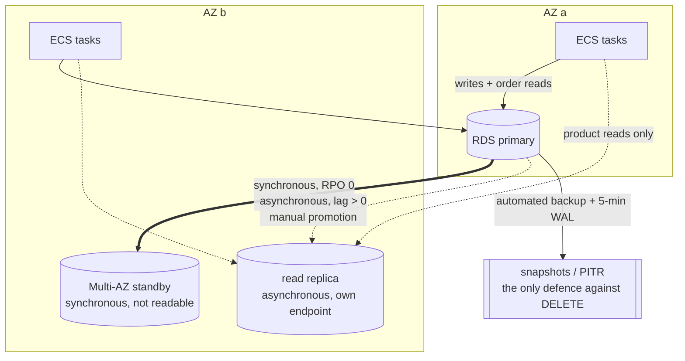

# ADR-007: Database High Availability for V6

## Context

Business requirements for V6:

```text
RTO <= 5 minutes
RPO ≈ 0
```

A database outage must not lose confirmed orders. Through V5, [infra/modules/rds](../../infra/modules/rds) was a single-AZ `db.t3.micro` with `skip_final_snapshot = true` and `deletion_protection = false` — a deliberate V1 trade-off for cheap `terraform destroy` cycles ([ADR-002](ADR-002-aws-foundation.md)). That configuration cannot meet either objective: an AZ failure takes the database with it, and `terraform destroy` (or an accidental console delete) can wipe confirmed orders with no recoverable snapshot.

The V6 spec's real lesson is a set of distinctions that are easy to blur:

```text
HA ≠ Backup
Backup ≠ Read Replica
Read Replica ≠ Disaster Recovery
```

Each mechanism answers a *different* failure. Treating any one of them as a substitute for the others is how you end up with an architecture that looks highly available on a slide and loses orders in practice.

## Decision

| Failure | Mechanism | RPO | RTO | Why not the others |
|---|---|---|---|---|
| AZ dies / instance dies | **RDS Multi-AZ instance deployment** (synchronous standby) | ≈ 0 | ~60–120s (automatic, same DNS endpoint) | Backups take tens of minutes + a new endpoint; a read replica is async and does not auto-failover |
| Data accidentally deleted / corrupted | **Automated backups + PITR** | ~5 min (WAL archive interval) | Tens of minutes + cutover to a **new** instance | Multi-AZ makes this *worse* — the `DELETE` reaches the standby in milliseconds |
| Read scaling (product catalogue) | **Asynchronous read replica** | n/a (scalability, not durability) | n/a | Not HA: promoting it loses unreplayed WAL; own endpoint; lag > 0 |
| Region disappears | **Nothing in V6** | — | — | Cross-region is V18 (Disaster Recovery) |



### 1. Multi-AZ instance deployment (not Multi-AZ DB cluster, not Aurora)

RDS Multi-AZ **instance** deployment keeps a synchronous standby in another AZ. A commit is acknowledged only after the standby has it, so RPO is 0 for AZ/instance failure and a confirmed order cannot be lost. Failover is automatic in roughly 60–120s via the **same** DNS endpoint — the application needs no config change, which is what makes RTO ≤ 5 minutes achievable.

Rejected alternatives:

* **Multi-AZ DB cluster** (two readable standbys) — requires `db.m6gd` / `r6gd` classes, roughly 10× the cost of this project's `db.t3.micro`. The learning value does not justify the bill.
* **Aurora** — a different engine with its own storage layer. Deferred; learning Multi-AZ RDS first keeps the mental model aligned with what most teams actually run.
* **Cross-region replica** — region failure is V18.

### 2. Automated backups + PITR (and why they cannot meet the RTO)

`backup_retention_period = 7`, explicit backup/maintenance windows, `copy_tags_to_snapshot`, and a final snapshot on destroy (`skip_final_snapshot = false` by default). `deletion_protection = true` by default so `terraform destroy` cannot silently wipe the database — teardown is now two deliberate steps (see [docs/deployment.md](../deployment.md) §10).

Backups are the **only** defence against accidental `DELETE` / corruption. They cannot meet RTO ≤ 5 minutes: a PITR restore creates a **brand-new** instance with a **new** endpoint and typically takes tens of minutes, after which the app still has to be repointed. That is the concrete payoff of the `restore-pitr` drill in [loadtest/ha_experiment.py](../../loadtest/ha_experiment.py).

### 3. Read replica for product reads only

An asynchronous same-region replica with its own endpoint. Used exclusively by `GET /products` and `GET /products/{id}` ([app/product/router.py](../../app/product/router.py)). Order and customer paths stay on the primary: a customer reading their own order immediately after placing it cannot tolerate replica lag (the read-your-own-writes hazard, measured by the `lag` drill).

On replica `OperationalError`, product reads fall open to the primary and log `read_replica_unavailable` — the same fail-open shape as [app/core/cache.py](../../app/core/cache.py). CloudWatch turns that log line into an alarm, because a request that fell back still returns 200 and is invisible to infrastructure metrics.

The worker stays on the primary (`READ_REPLICA_ENABLED=false`): it writes `processed_events`.

### 4. Application changes so a failover is survivable

* `pool_recycle` on the SQLAlchemy engine — bounds how long a pooled connection to a pre-failover primary can linger. `pool_pre_ping` (V2) already discards dead connections on checkout; recycle is the belt.
* Short transient-error retry (**reads only**, 2 attempts). Retrying a write whose commit outcome is unknown is the database version of V5's `PAYMENT_PENDING` problem — writes fail fast and let the client decide.
* Local Compose runs a real Postgres streaming standby (`db-replica`) so lag, promotion, and RPO are learnable without paying for AWS — same "swappable backend, identical interface" pattern as Postgres/RDS, Redis/ElastiCache, LocalStack/SQS.

### 5. Observability that can see a failover

A Multi-AZ failover is invisible to every existing alarm: CPU is fine, the ALB sees 200s afterwards, the endpoint never changed. [infra/modules/cloudwatch](../../infra/modules/cloudwatch) therefore adds:

* `aws_db_event_subscription` on `failover` / `availability` / `deletion` / `failure` / `low storage` / `maintenance`
* `ReplicaLag` alarm (when the replica exists)
* Log-metric-filter alarm on `read_replica_unavailable`

The event subscription lives in cloudwatch (not rds) to avoid a module dependency cycle: the SNS topic is owned by cloudwatch, and rds already feeds identifiers into it.

## Answers to the spec's four questions

| Question | Answer in this architecture |
|---|---|
| AZ dies? | Multi-AZ automatic failover (~60–120s). Same endpoint. RPO ≈ 0. |
| Database instance dies? | Same as AZ — the standby is promoted. |
| Data is accidentally deleted? | Multi-AZ does **not** help (the delete is replicated). Restore via PITR to a new instance; RTO is tens of minutes; then repoint the app. |
| Region disappears? | Nothing here helps. Cross-region is V18. |

## Alternatives considered

| Option | Why rejected |
|---|---|
| Multi-AZ DB cluster | Instance-class cost floor incompatible with a learning project's `db.t3.micro` |
| Aurora PostgreSQL | Different engine; learn RDS Multi-AZ first |
| Serve all reads from the replica | Breaks read-your-own-writes for orders; correctness hazard disguised as scaling |
| Skip the local standby | Makes lag / RPO / promotion unlearnable without an AWS bill |
| Rely on backups for HA | PITR cannot meet RTO ≤ 5 min (measured by the restore drill) |

## Trade-offs

* **Cost**: Multi-AZ roughly doubles the RDS instance bill; the replica adds a third. Defaults are the safe ones; `terraform.tfvars` can flip them off for cheap idle periods ([docs/deployment.md](../deployment.md) §10).
* **RTO is ~60–120s, not zero**: in-flight requests during the flap fail; the short read retry covers the connection bounce, not the whole window. Clients must retry writes.
* **Synchronous commit latency**: Multi-AZ adds a cross-AZ sync on every commit. Acceptable for this workload; the local Compose default stays *asynchronous* so the RPO experiment can demonstrate the difference by flipping on `synchronous_standby_names`.
* **Stale product reads**: bounded by replica lag (and by the existing Redis TTL). Documented in [docs/api.md](../api.md).
* **Teardown is two steps**: `deletion_protection = true` means `terraform destroy` fails until protection is disabled. Deliberate — the previous default made wiping confirmed orders a one-liner.

## Consequences

* Terraform module defaults flip from "cheap to destroy" to "safe to keep data".
* Product GET routers depend on `get_read_db`; integration tests must override it ([tests/integration/conftest.py](../../tests/integration/conftest.py)).
* `/health/ready` gains an informational `database_replica` check (`required: false`).
* V10 (CQRS) may later absorb the read model; V6's split is deliberately narrow so that evolution stays possible.
* V18 (Disaster Recovery) owns cross-region; this ADR must not be stretched to cover it.
