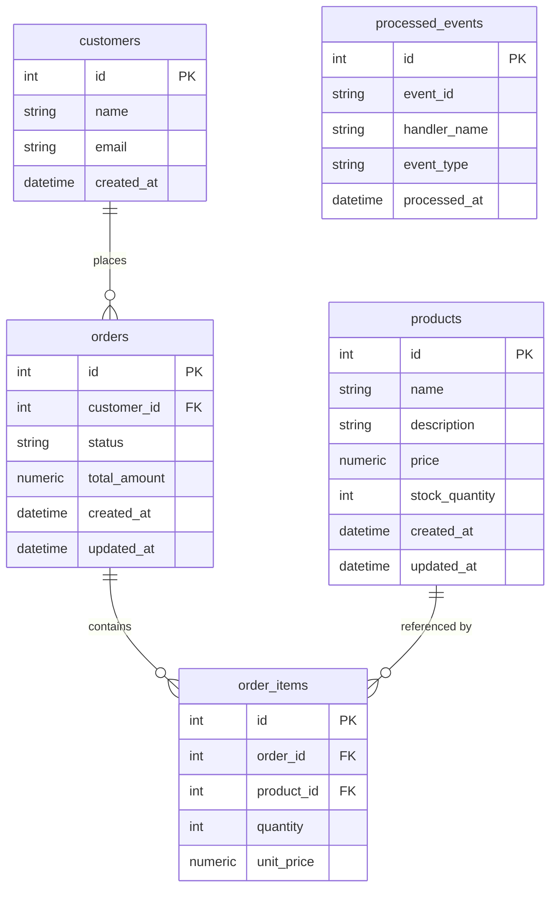

# V0 Database Schema

Single PostgreSQL database, shared by all modules (database-per-service is introduced later, at V7).

## Notes

* `order_items.unit_price` is copied from `products.price` at order creation time, so historical orders are unaffected by later price changes.
* `orders.status` is one of `PENDING`, `PAID`, `PAYMENT_FAILED`, `PAYMENT_PENDING` (V5), `CANCELLED`.
* **`processed_events` (V5)** has no foreign keys and no relationship to the domain tables — it's infrastructure, not a domain entity ([app/core/models.py](../app/core/models.py)). One row per `(event_id, handler_name)` pair that has *completed*, with a unique constraint on the pair. It's the durable record that a given side effect already ran, making SQS's at-least-once delivery safe to reprocess. It lives in Postgres rather than Redis because a record that can be evicted or lost on restart cannot be the only thing preventing a duplicate charge — see [ADR-006](adr/ADR-006-reliability.md). It grows by (events × handlers) and has no cleanup yet; a retention job becomes necessary at real volume.
* No migration tool (e.g. Alembic) is used in V0 — `Base.metadata.create_all()` runs on app startup. This is a deliberate simplification (see [ADR-001](adr/ADR-001-modular-monolith.md)); a real migration tool becomes necessary once the schema needs to evolve without dropping data.
