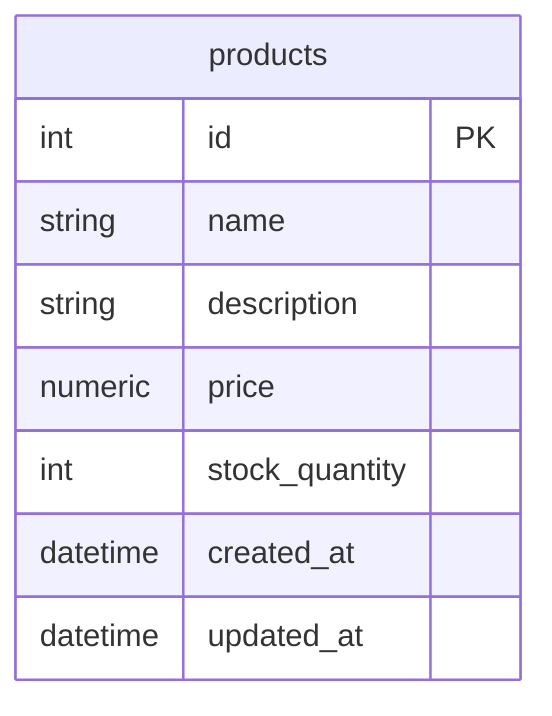
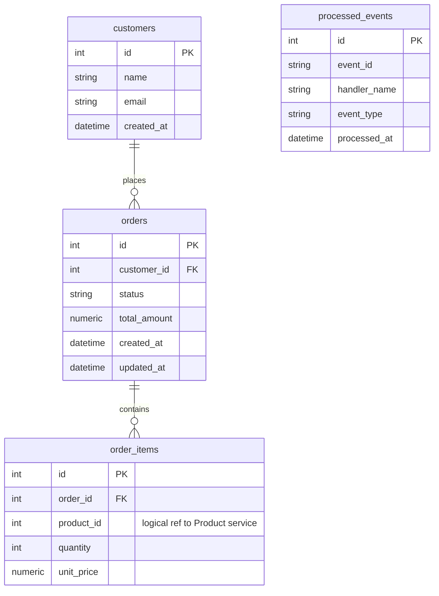
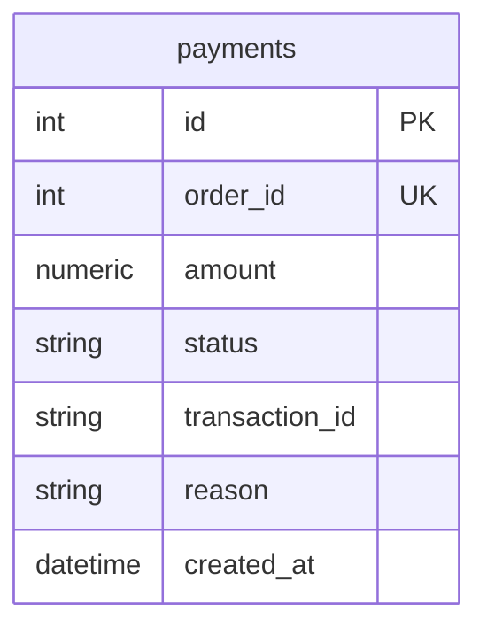

# Database Schema (V7 — database-per-service)

Each service owns its PostgreSQL database. There are **no cross-database foreign keys**. `order_items.product_id` is a logical reference only.

Locally: three Compose Postgres containers (`product-db`, `order-db`, `payment-db`) plus `product-db-replica`.  
AWS: three logical databases on one RDS instance (`commerceops_product`, `commerceops_order`, `commerceops_payment`), created at startup by [`app/core/ensure_database.py`](../app/core/ensure_database.py).

## Product DB (`commerceops_product`)

Stock mutations for orders go through `POST /internal/stock/reserve` and `/release` (Product service), not through Order's database.

## Order DB (`commerceops_order`)

`processed_events` is written by the Order **worker** (same DB). See [ADR-006](adr/ADR-006-reliability.md).

## Payment DB (`commerceops_payment`)

`order_id` is the idempotency key: a retried charge returns the stored row.

## Notes

* `order_items.unit_price` is copied from Product's reserve response at order time.
* `orders.status` is one of `PENDING`, `PAID`, `PAYMENT_FAILED`, `PAYMENT_PENDING` (V5), `CANCELLED`.
* Still no Alembic — each service runs scoped `Base.metadata.create_all(..., tables=[...])` on startup.
* See [ADR-008](adr/ADR-008-microservices.md).
